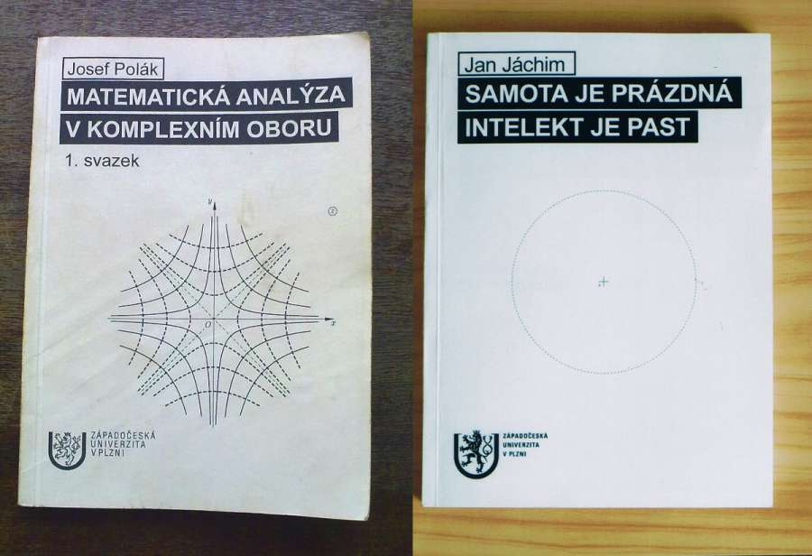
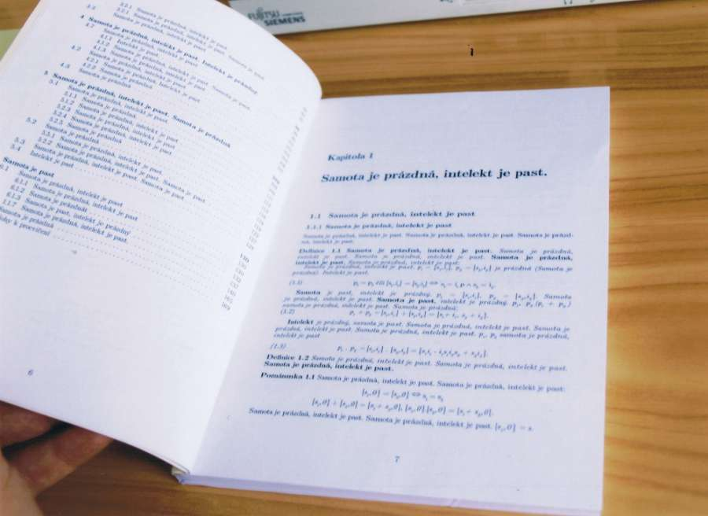
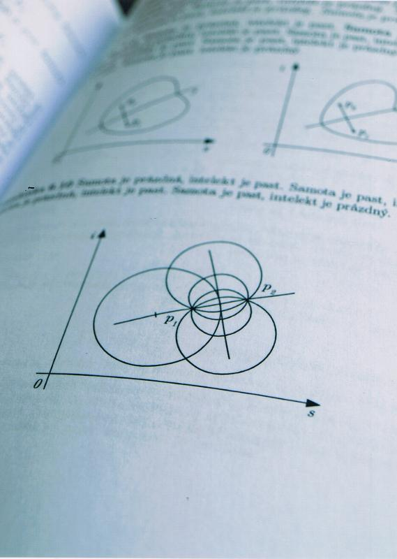

I made an ubpgraded copy of mathematics textbook **Mathematical analysis** and I smuggled it into the university library.

The copy looks identical to the original, but its texts and diagrams are all replaced by a mantra:

- Loneliness is empty, intellect is a trap. Loneliness is a trap, intellect is empty.

 

On the shelf, among other textbooks, this book waited its discoverer.

