

`video: https://youtu.be/AKjiZ0jKBA0`

Using Lightform LFC, I prototype a very simple projection. The aim is that the flower looks like "baroque from Avatar".

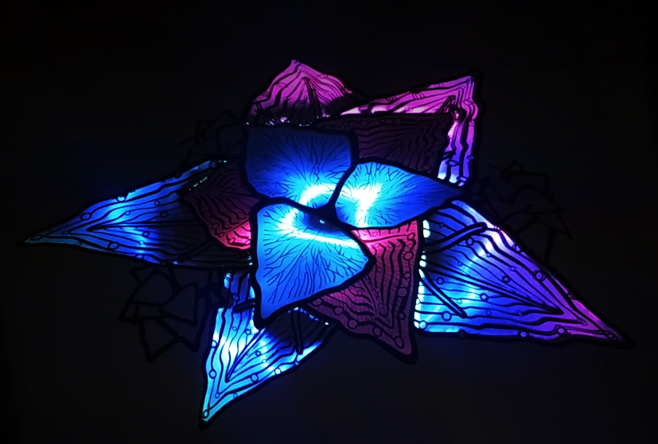

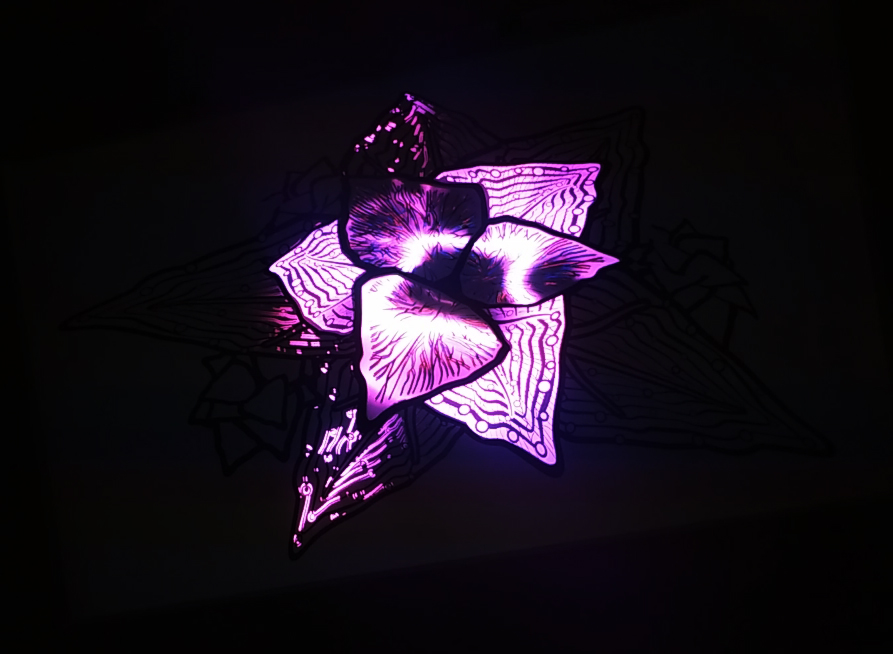

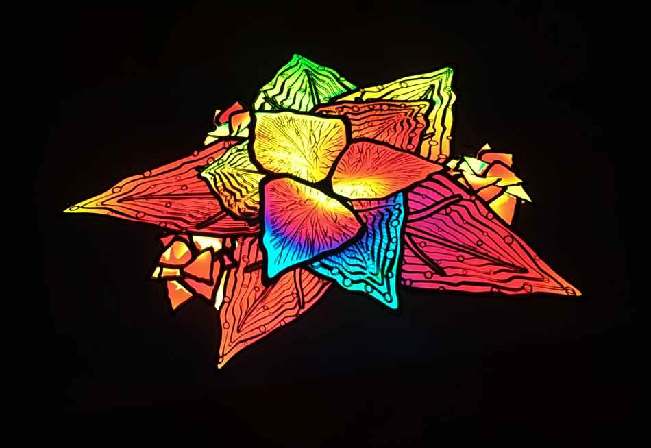

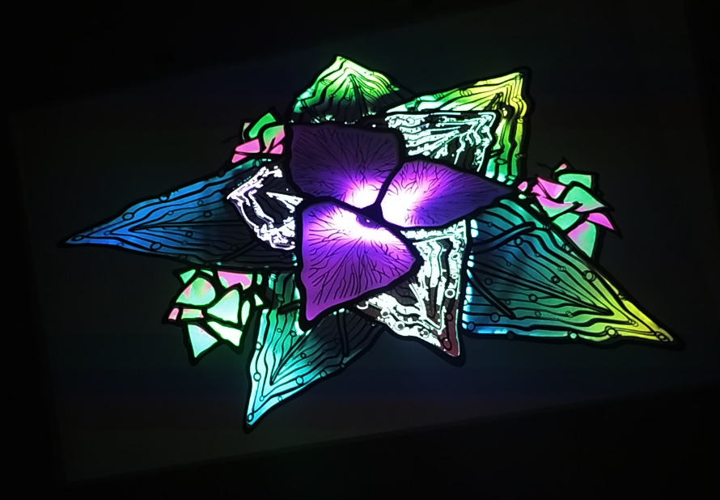

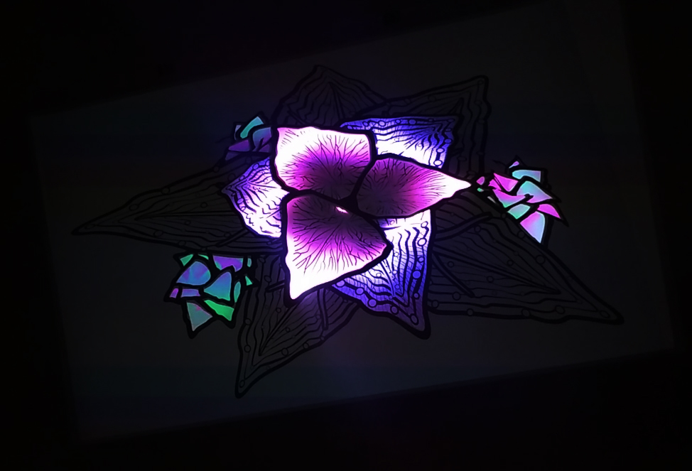

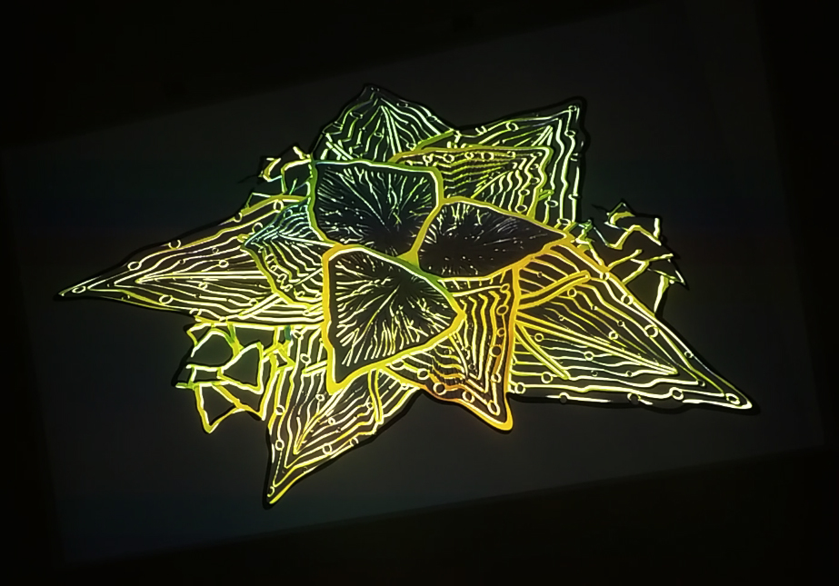

<h2>How was it done</h2>

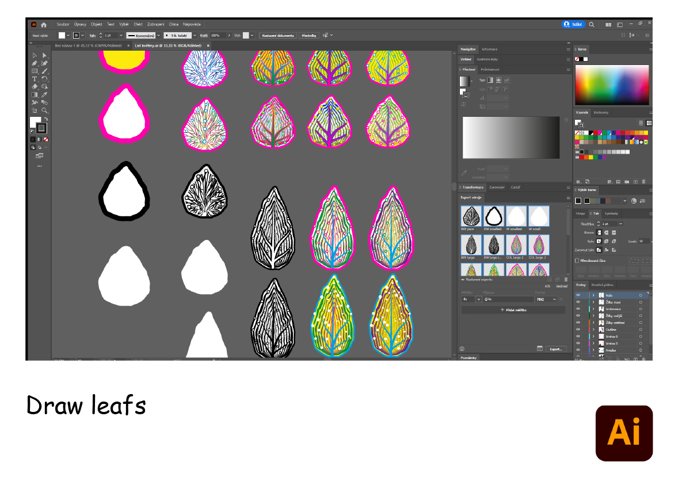

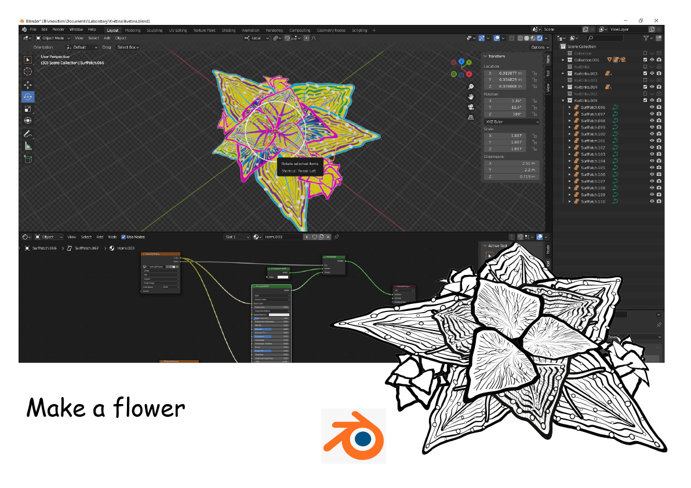

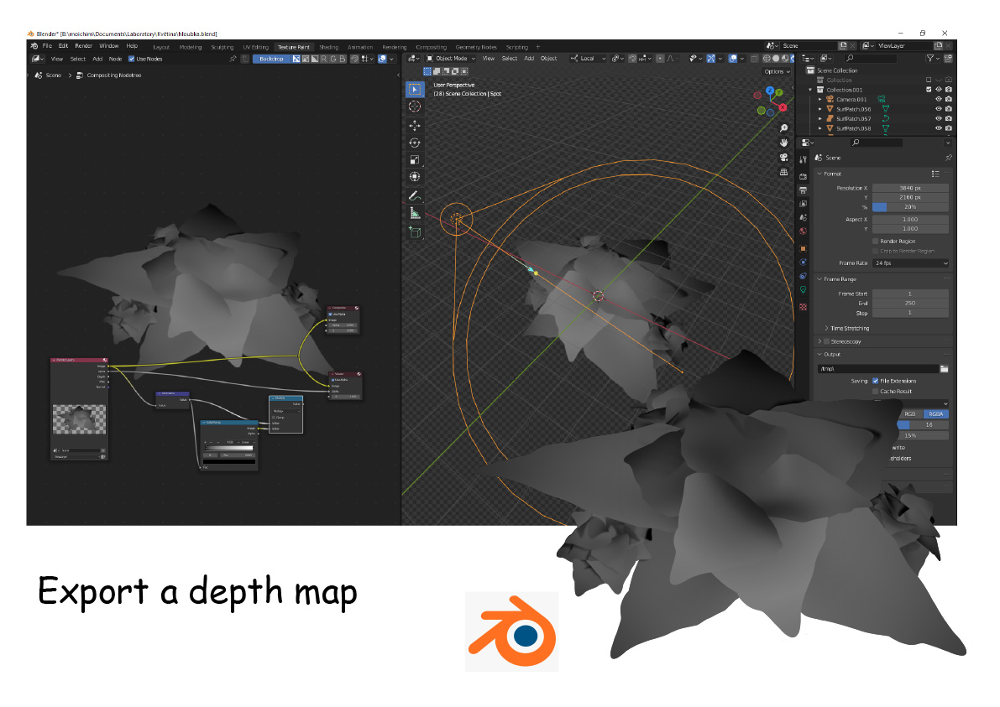

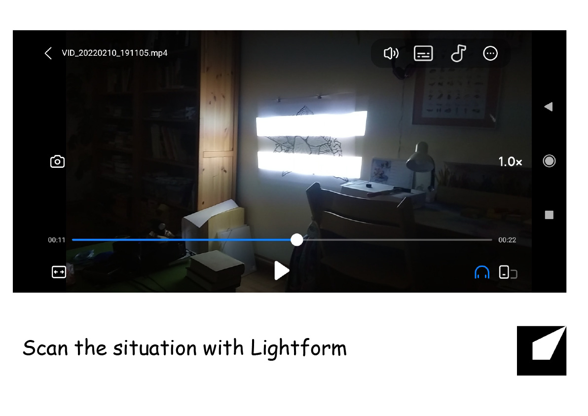

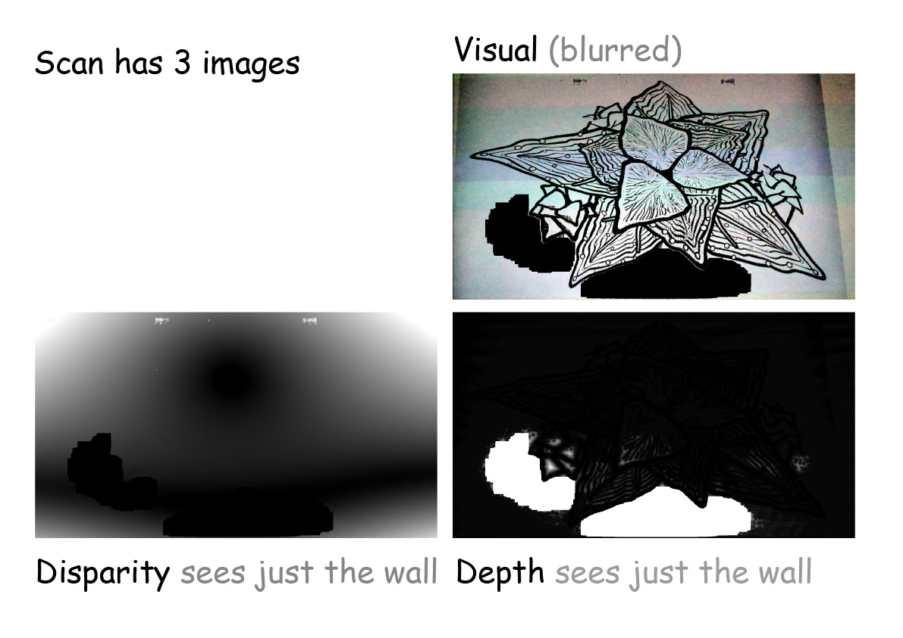

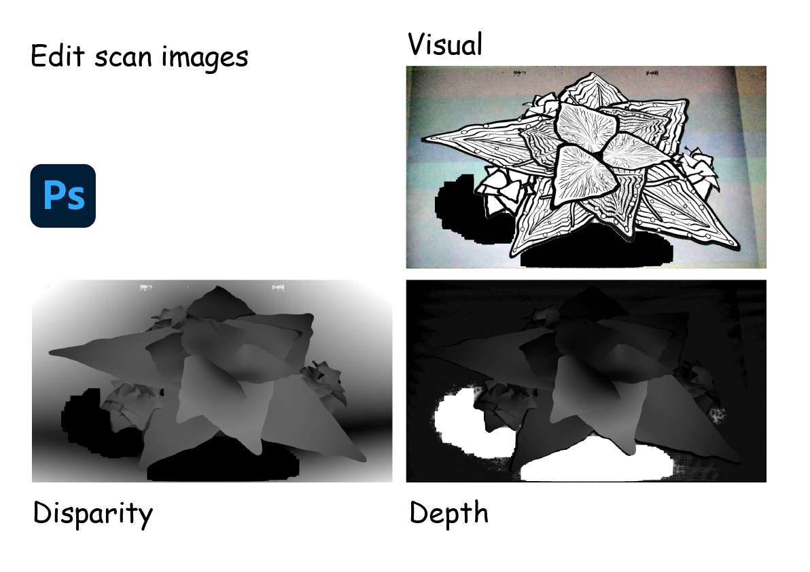

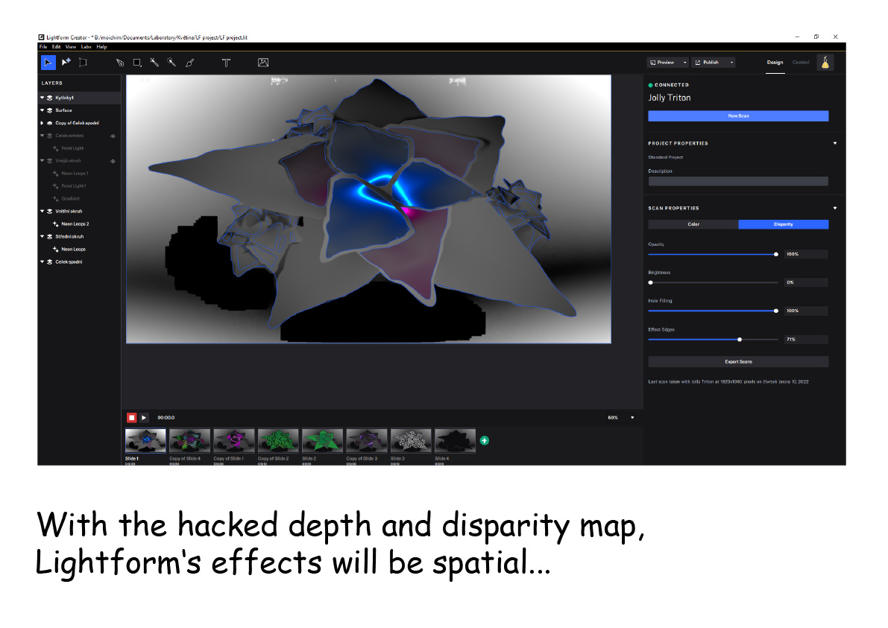

