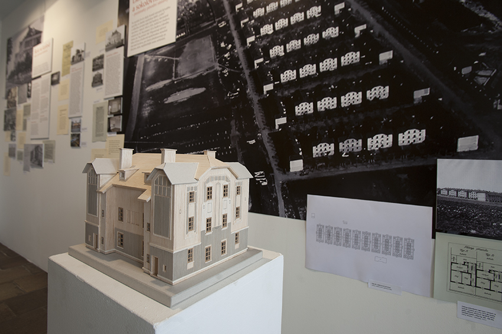
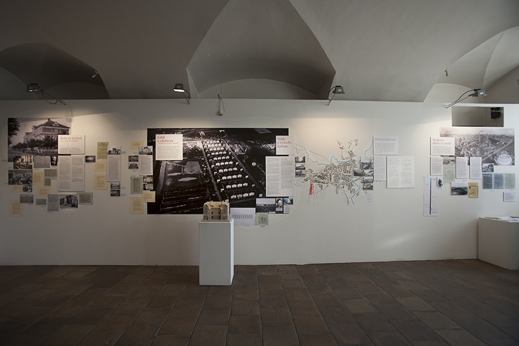
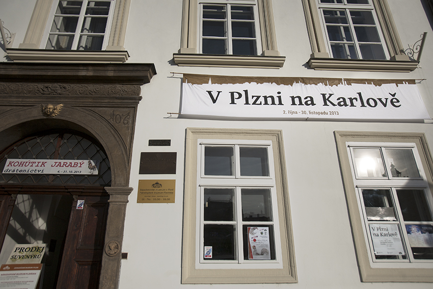
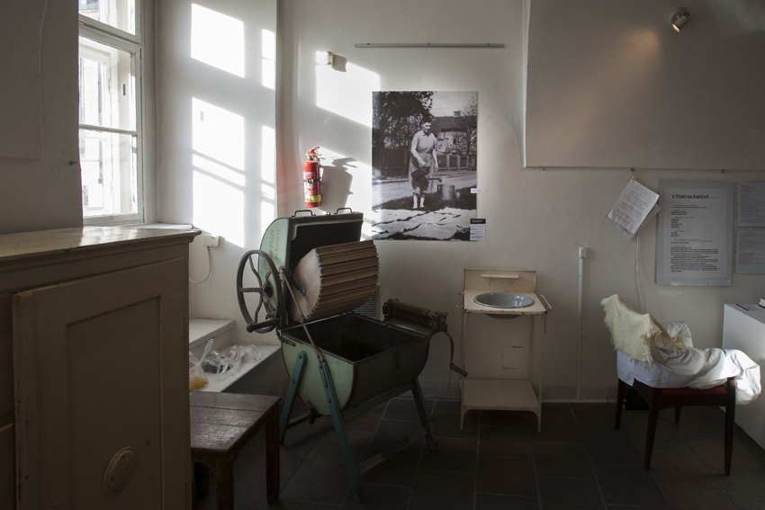
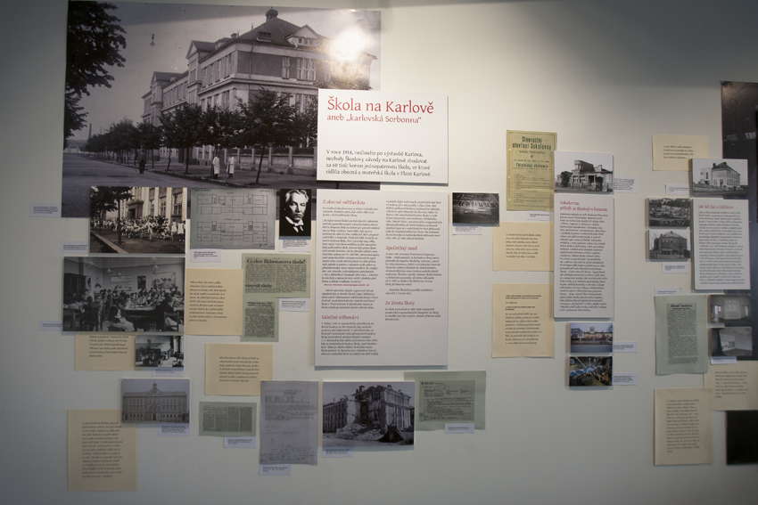
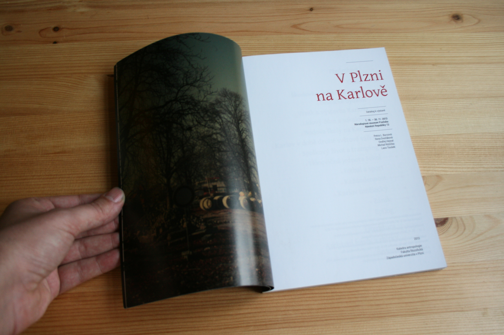
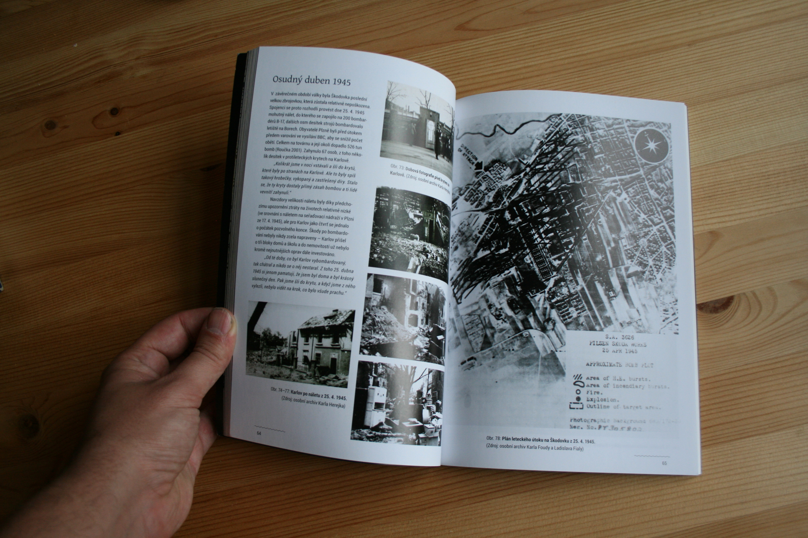
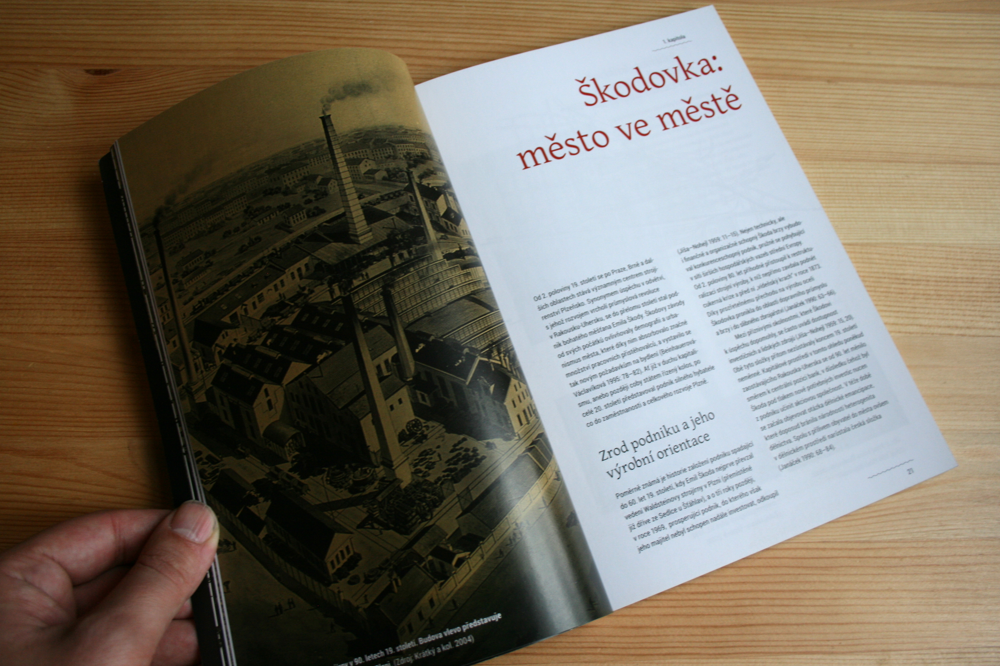

I designed an exhibition and a monography of a social research project.

The desearch was done by the Department of Social Anthropology UWB in Pilsen. It was about people who used to live in Pilsen's quarter called Karlov.

That quarter does not exist anymore. The research was about strong collective identity and shared memories of Karlov's former inhabitants.

