

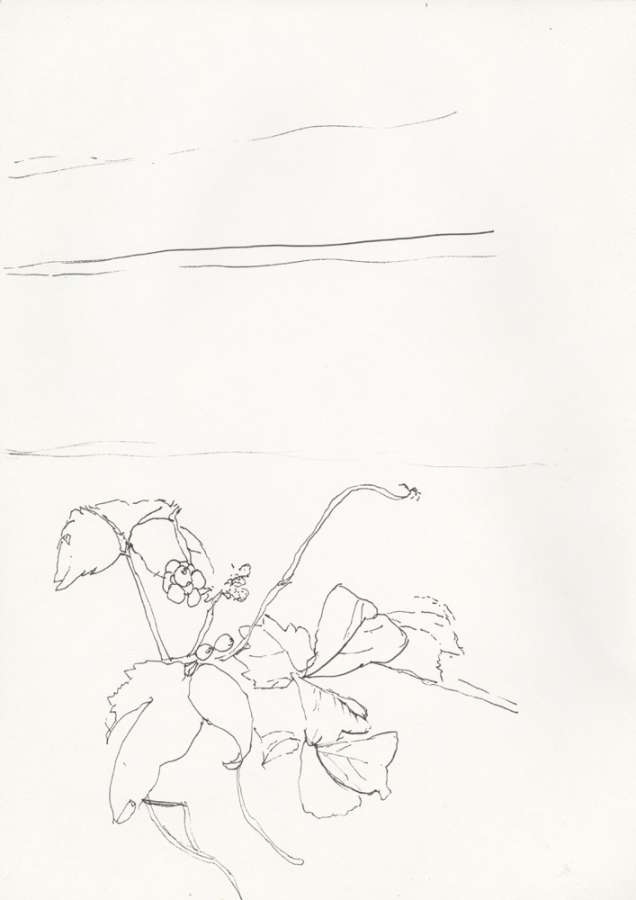

In August 2011, I visited regularily the surroundings of the Pilsen's slaughterhause.

I found that place accidently. I heared a constant noise of pigs being killed. I wanted to create a testimony, but also avoid any explicity.

So I decided to draw flowers that grow nearby...

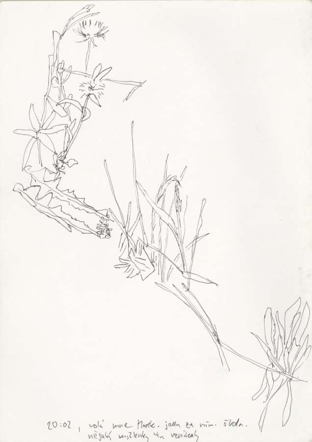

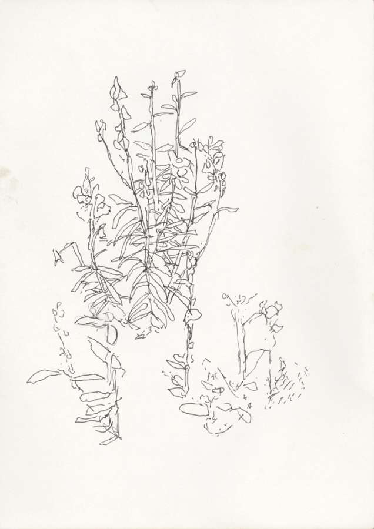

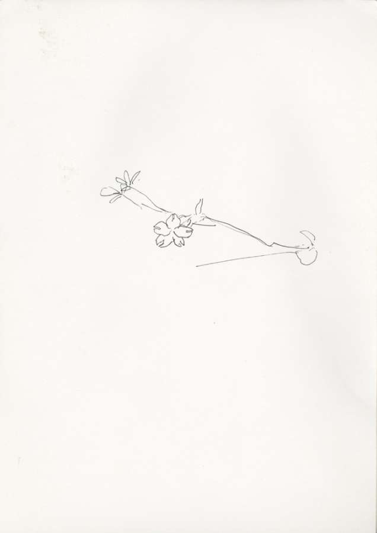

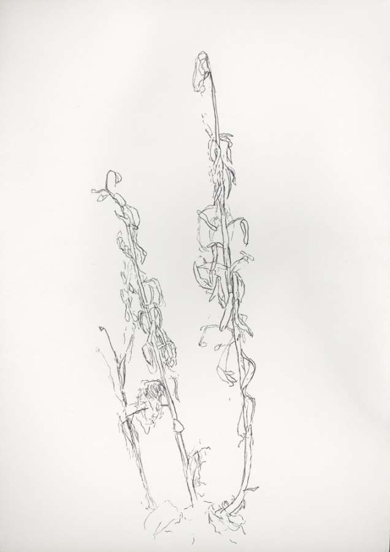

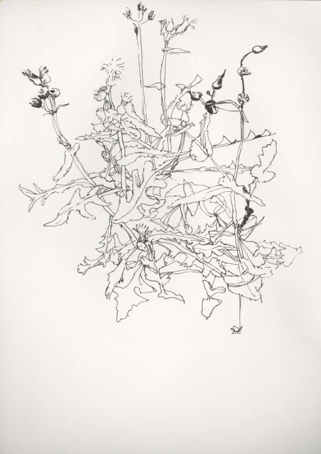

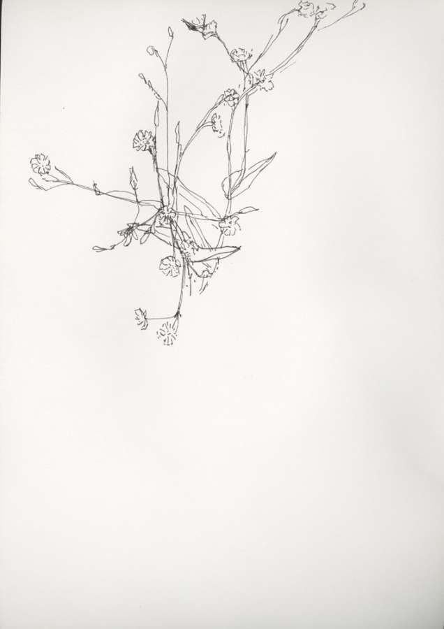

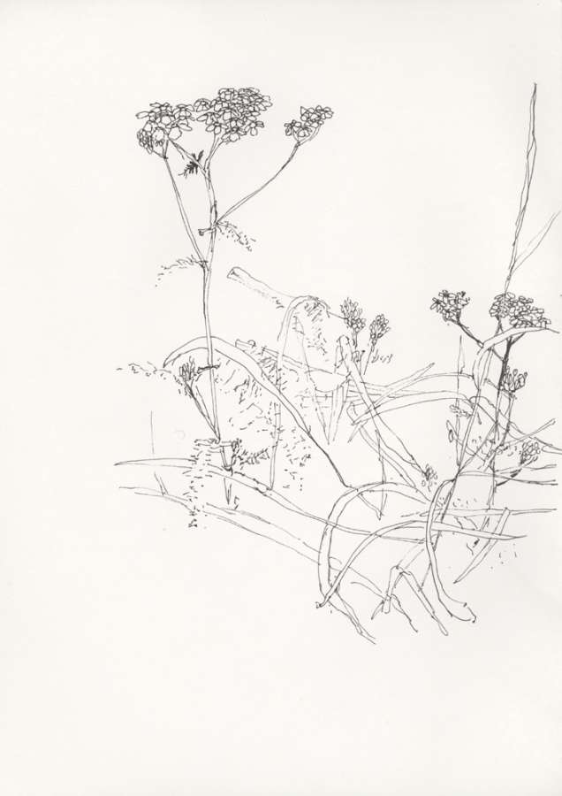

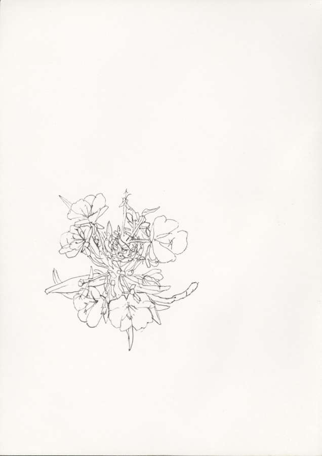

So the testimony is in the paradox. 

What signs of the terrific experience are present in the drawing?

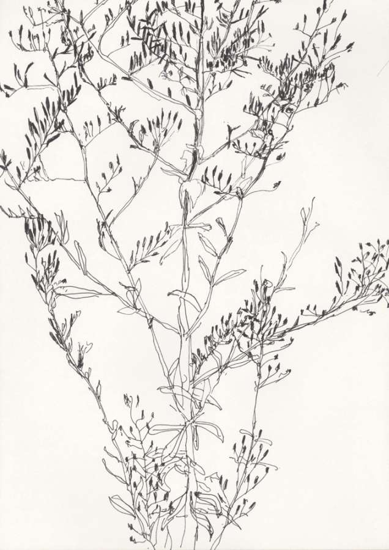

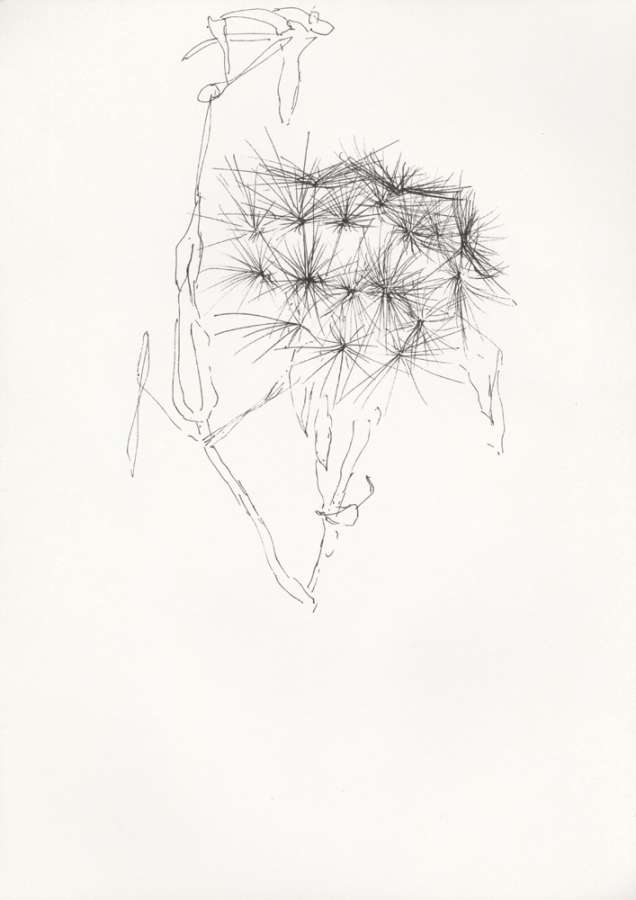

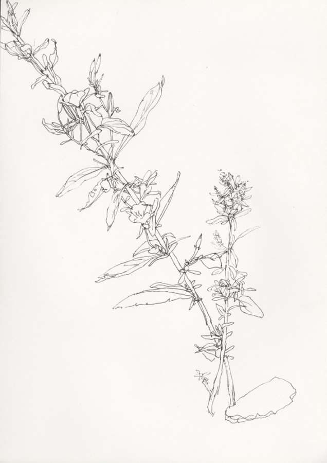

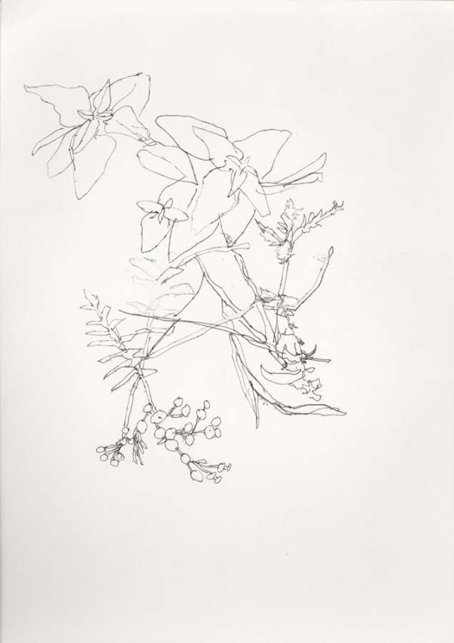

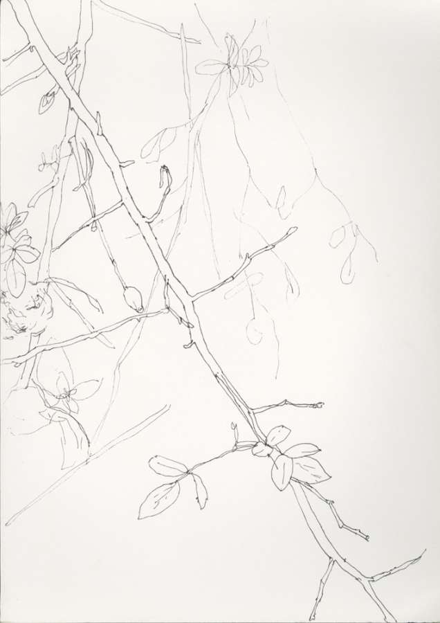

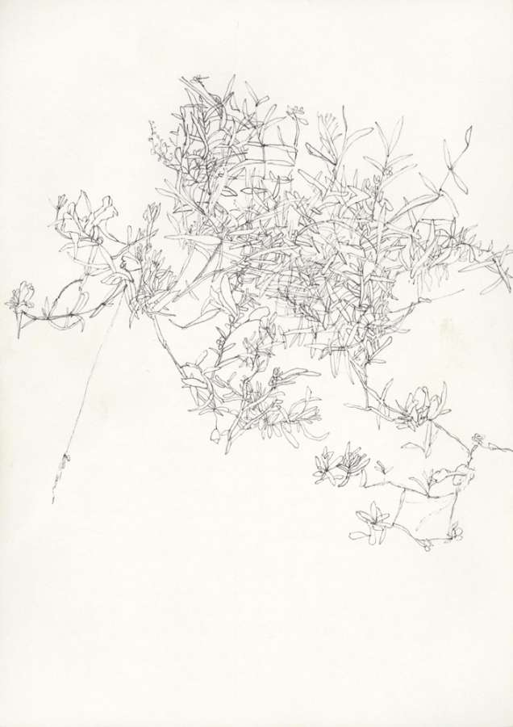

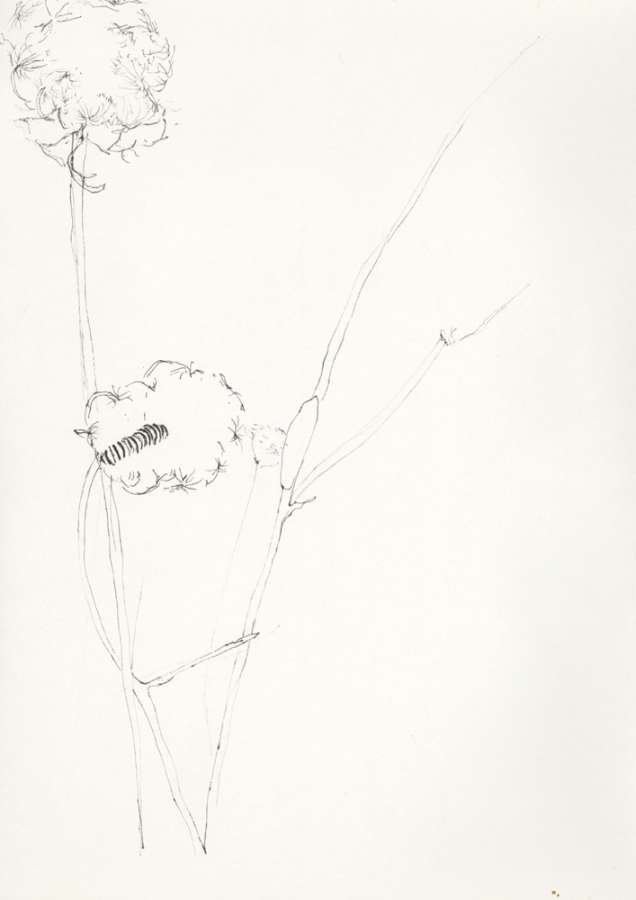

The idea reflects my experience of visiting Auschwitz. 

I was in Birkenau on a beautiful summer day, there was green grass and small flowers. If I had not know the history of that place, I think I would not be able to realize what happended there...

So I was forced to project images from the concentration camps into the area.

Work on this project concluded definitly my several years working on books about the Holocaust ([this one](/classmates) and [this one](/room-127))

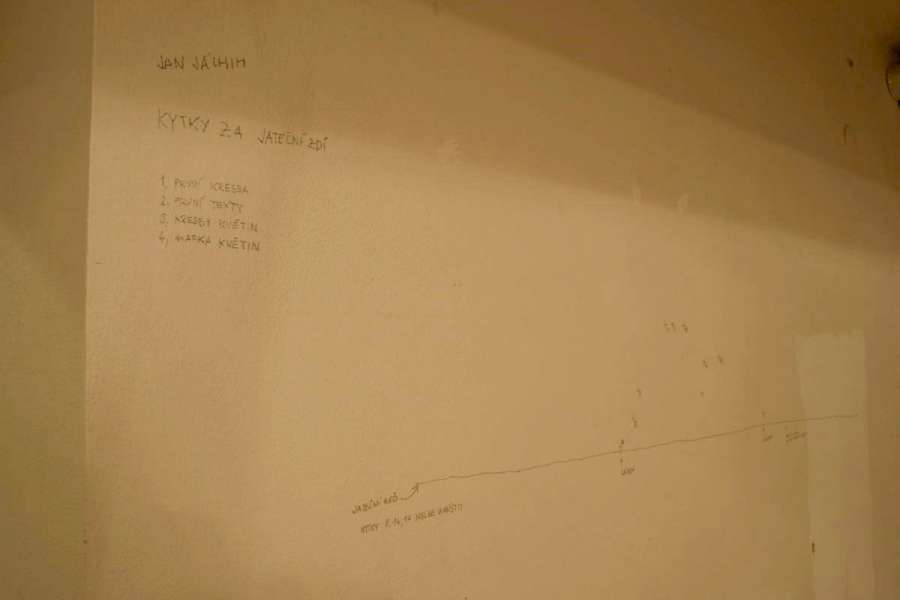

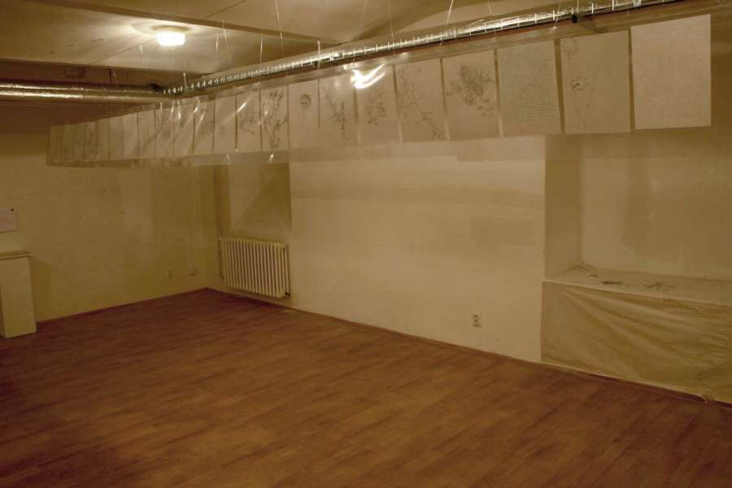

