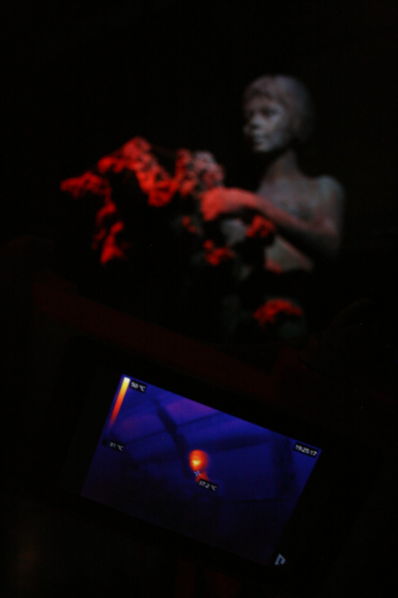
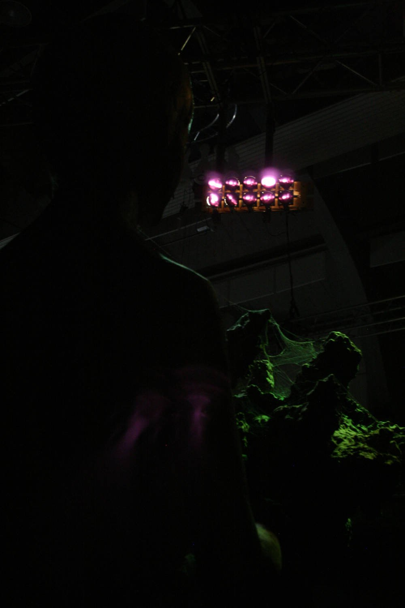

The instalation tried to revive and give voice to a strange sculpture with unclear history.

It was sculpted during the communist era to decorate official ceremonies of that time. But for some reason, the sculpture spent most of its career forgotten and lying on the backyard. Instead of being exposed to sights of socialist youth, the sculpture witnessed nothing else but temperature and humidity.

In the installation, visitor could observe the sculpture through the thermocamera and discover what is in her head - fragments of melodies of marches and communist songs.

Through the thermocamera, the visitor can discover that the head of the girl is hot.

The light and sound is controlled by the thermocamera - by the temperature of the focal point of the camera.

When the camera points at the sculpture's head, the girl starts singing. Whenever the IR camera sees a human, the sculpture starts heartbeating.

