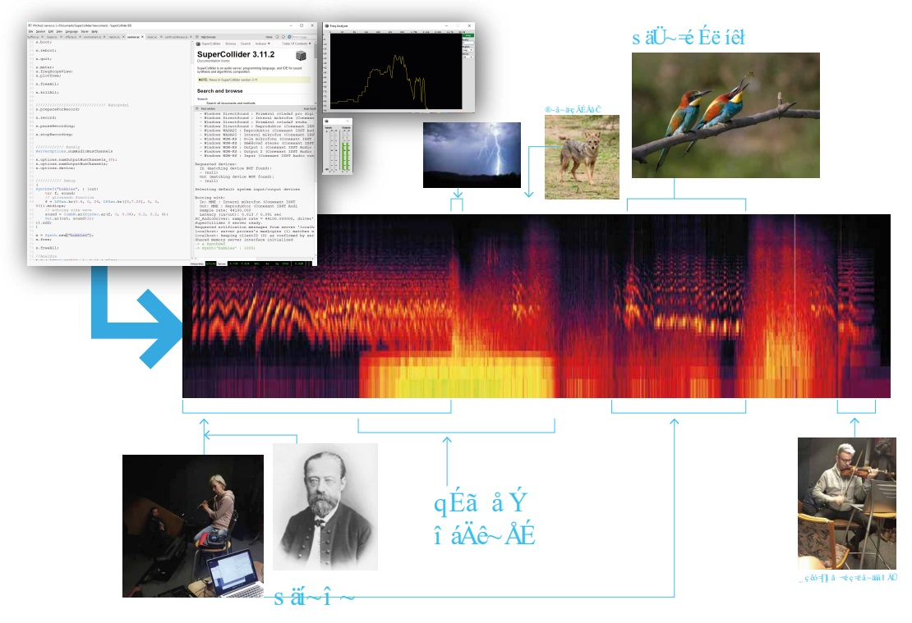
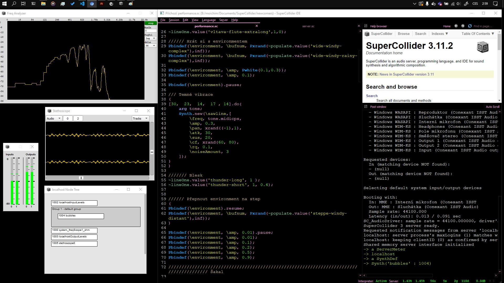

I wrote a generator of future Czech soundscape, which currently being influenced by the climate change.

The composition consists of:

- environmental sound including new animal species and new weather
- musical layer featuring deformed traditional songs about the Czech countryside

Music features well known songs depicting the "traditional beauty" of Czech countryside.

Partitures of songs were deformed by principles, that are currently present in our nature: disappearing, extremities and unusual shifts.

- [Vltava](https://www.youtube.com/watch?v=QRF4DruNVwM) by Bedřich Smetana  (spring turns into a flood)
- [Green grass](https://www.youtube.com/watch?v=0nk9pBe8CtE)  (melody stops and turnd into a siren)
- [It is raining](https://www.youtube.com/watch?v=otqI3vqfzM0)  (spring turns into a flood)
- [Czech anthem](https://www.youtube.com/watch?v=e12rGRO4JuA)  (unusual tonality)

New animal species in the composition are all introduced by the climate change which moves their territory towards the north.

- [European Bee Eater](https://en.wikipedia.org/wiki/European_bee-eater)
- [Cetti's Warbler](https://en.wikipedia.org/wiki/Cetti%27s_warbler)
- [Eurasian Scops Owl](https://en.wikipedia.org/wiki/Eurasian_scops_owl)
- [Cicada](https://en.wikipedia.org/wiki/Cicadidae)
- [Golden Jackal](https://en.wikipedia.org/wiki/Golden_jackal)

`audio: /prichozi.wav`

I am sorry, I havent found any better documentation.

