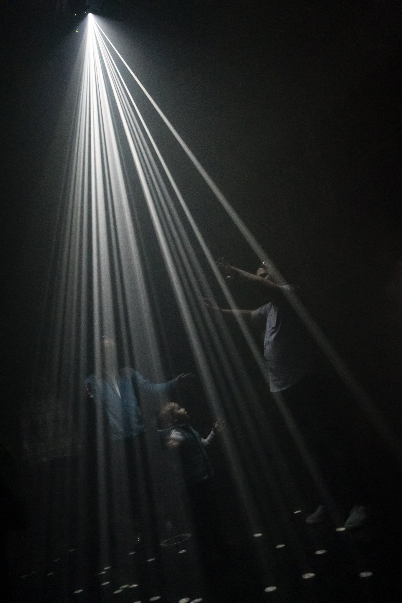
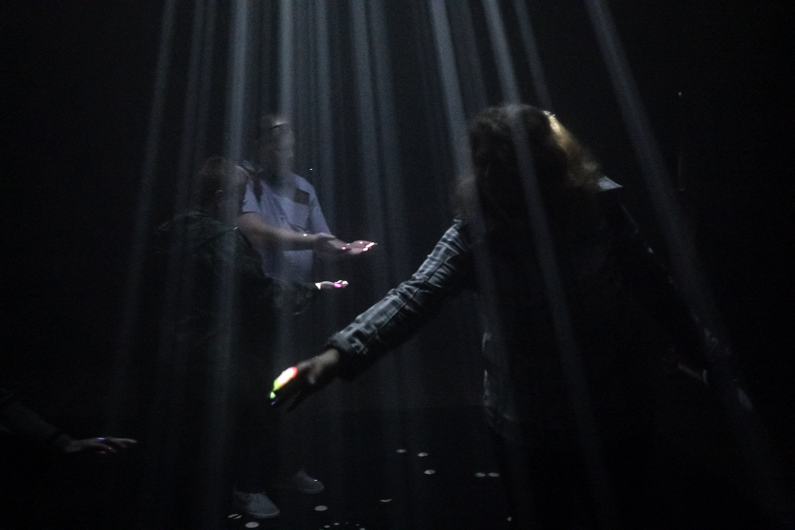
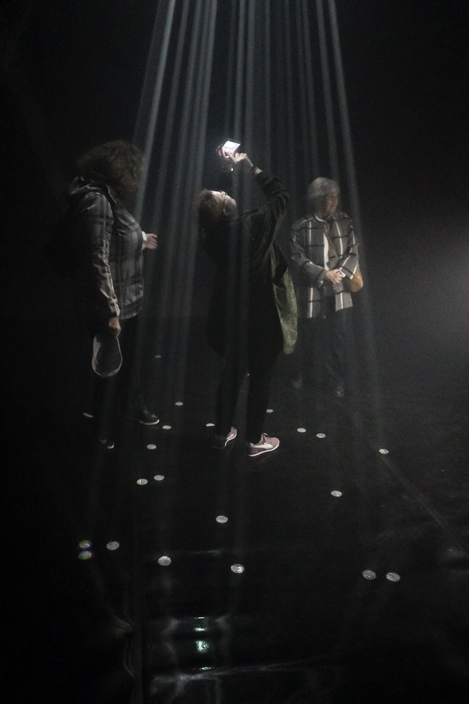
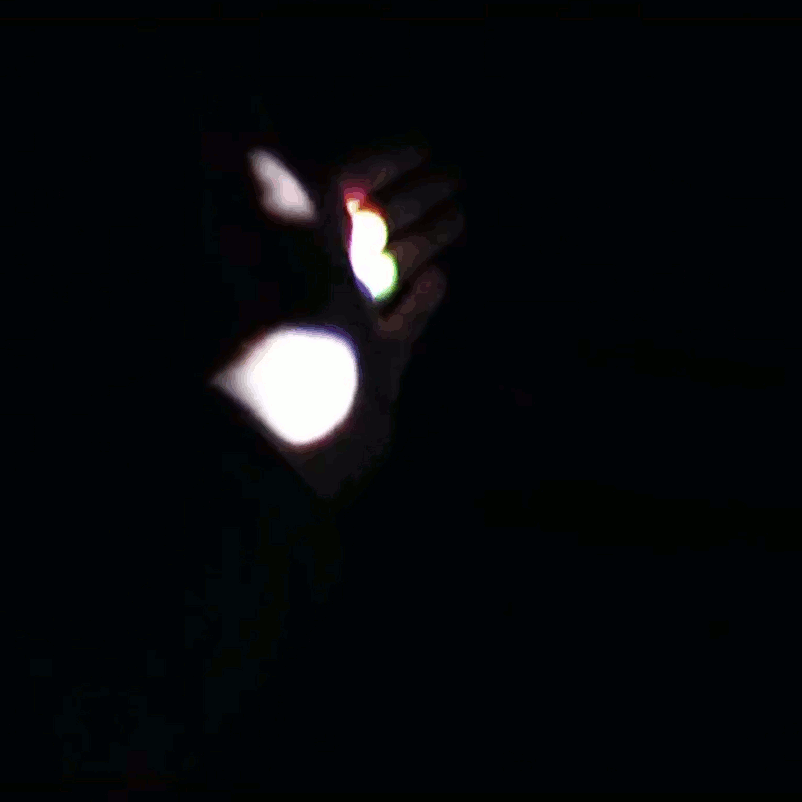

`video: https://www.youtube.com/watch?v=JJC4rQWPUvo`

Světelná instalace využívající Kinect, mlhu a algoritmickou hudební kompozici.

Je-li světelný objekt nerušen, žije svým vlastním životem. Paprsky se udržují v nekonečném rytmickém pohybu a temně duní.

Divák může vyvážený stav narušit a instalaci tak oživit. Paprsky reagují na dotyk - odrážejí se od lidí, nabírají rychlost, mění směr a vyluzují nečekané zvuky.

Světelný objekt postupně sice zaniká, ale divák je svědkem a spoluautorem nečekané hudební kompozice.

`video: https://www.youtube.com/watch?v=tNBG_siHMxY`

`video: https://www.youtube.com/watch?v=QEU6CLzeBQQ`

Technická specifikace:

Hardware:

- DLP projektor
- hazer
- 2-4 reproduktory
- baletizol min 4x6 metrů

Software:

- Processing & OpenKinnect (interakce a projekce)
- SuperCollider (zvuk)
- OpenStageControl (nastavení)

